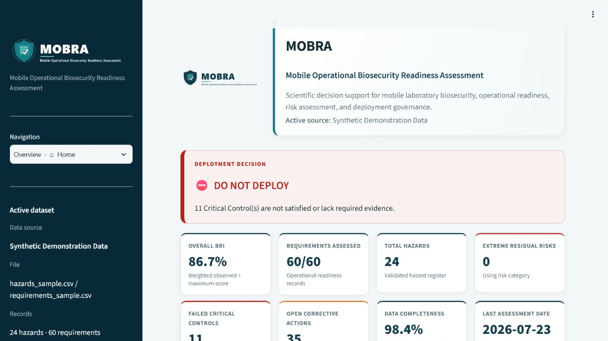
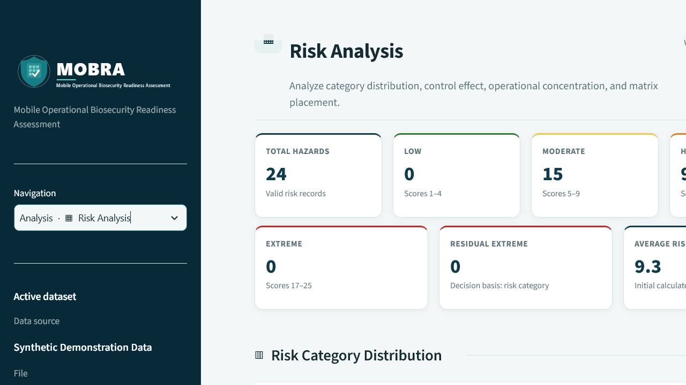
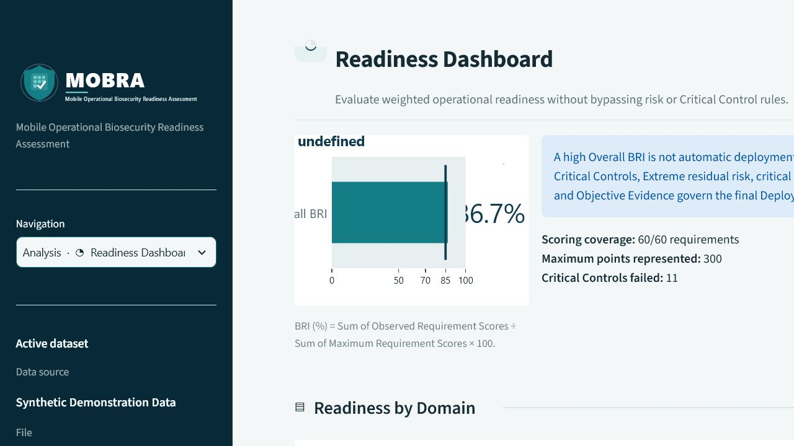
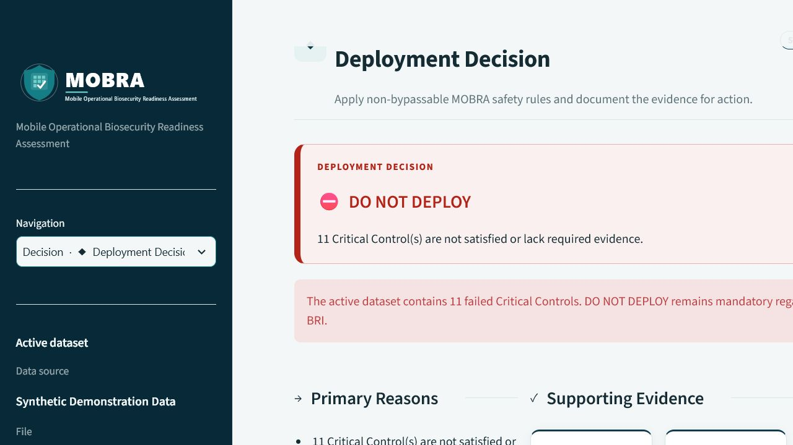
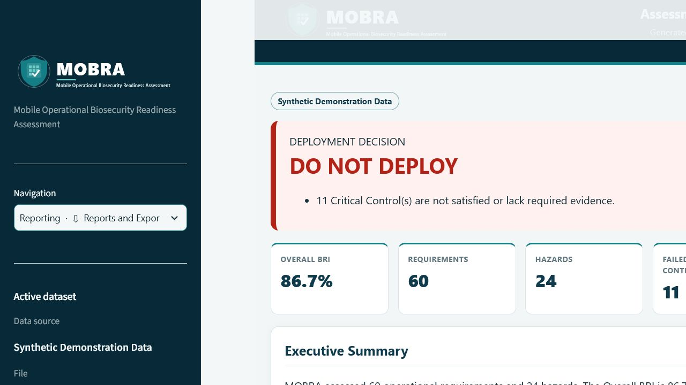
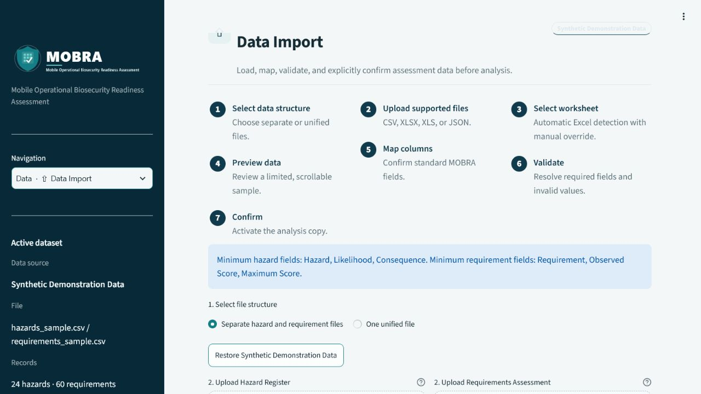
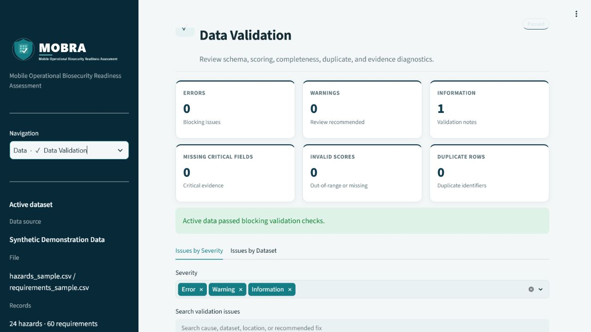

# MOBRA

**Mobile Operational Biosecurity Readiness Assessment**

MOBRA is a Streamlit decision-support application for assessing the operational readiness and biosecurity of mobile biological laboratories. It combines operational requirements, Critical Controls, a hazard register, the Biosecurity Readiness Index (BRI), a 5 × 5 risk matrix, corrective actions, and transparent deployment-decision rules.

MOBRA supports technical verification, prototype testing, and external-data compatibility assessment. It is not clinical, regulatory, field, or final scientific validation of the MOBRA methodology.

The current interface also provides optional secrets-backed sign-in, contextual
executive gauges, a clearly synthetic interactive mission workflow, and a
dedicated Research and References view. The Equations & Practical Calculations
page adds manuscript-traceable formulas, worked examples, and validated
interactive calculators without duplicating the central decision rules.



The reconciliation of the visually refined interface with the preserved
advanced functions is documented in
[FUNCTION_PRESERVATION_MATRIX.md](FUNCTION_PRESERVATION_MATRIX.md).

## Installation and local run

On Windows PowerShell:

```powershell
py -3.12 -m venv .venv
Set-ExecutionPolicy -Scope Process -ExecutionPolicy Bypass
.venv\Scripts\Activate.ps1
python -m pip install --upgrade pip
python -m pip install -r requirements.txt
streamlit run app.py
```

If `py` is unavailable, use `python -m venv .venv`. The application normally opens at `http://localhost:8501`.

For development and testing, install `requirements-dev.txt` instead; it includes
the runtime dependencies plus the test runner.

## Application workflow

1. Open **Data Import**.
2. Choose separate Hazard Register and Requirements files, or one unified file.
3. Upload CSV, XLSX, XLS, or JSON.
4. For Excel, review the automatically detected worksheet and override it if needed.
5. Preview a limited, scrollable sample.
6. Review automatic Column Mapping confidence and set any required overrides.
7. Validate required fields, scales, identifiers, dates, scores, and evidence.
8. Explicitly confirm the analysis copy.
9. Optionally load the requirement–hazard mapping and Critical Control
   governance profile under **Advanced supporting data**.
10. Review Requirements, Hazards, Risk Matrix & Heatmap, Readiness,
    Deployment Decision, and Corrective Actions.
11. Open **Equations & Calculations** to inspect source-traceable equations,
    test calculator inputs, and review the Critical-Control override.
12. Generate branded CSV, XLSX, JSON, HTML, mapping, governance, acceptance,
    field-workbook, printable-PDF, and resource-catalogue outputs.

The original source file is never overwritten.

## Pages

- **Home** — executive status, Deployment Decision, KPIs, domain readiness, risk, Critical Controls, and priority actions.
- **Data Import** — guided file selection, upload, worksheet choice, preview,
  column mapping, validation, confirmation, and optional relationship/governance
  supporting data.
- **Data Validation** — grouped errors, warnings, information, structured
  cross-dataset findings, search, and downloadable validation reports.
- **Requirements Assessment** — readiness, Critical Controls, Objective
  Evidence, requirement–hazard coverage/rankings, governance detail, filters,
  and focused requirement detail.
- **Hazard Register** — initial/residual risk, filters, ownership, status, controls, and focused hazard detail.
- **Risk Matrix & Heatmap** — category distribution, initial/residual
  comparison, domain concentration, top hazards, verified 5 × 5 matrix, and
  supplementary risk-acceptance review.
- **Readiness Dashboard** — compact Overall BRI, score-ratio domain readiness, and least-ready-domain priorities.
- **Mission Map** — synthetic, interactive deployment-gate workflow with
  tooltips, progress, and status legend; no real operational coordinates are
  represented.
- **Deployment Decision** — primary reasons, blockers, required actions, owners, dates, and reassessment conditions.
- **Corrective Actions** — priority, owner, target date, status, overdue flag, and completion evidence.
- **Reports and Export** — branded HTML report, structured Excel workbook,
  JSON/CSV outputs, advanced analysis exports, field workbooks, printable PDFs,
  import templates, and normative resource catalogues.
- **Equations & Calculations** — manuscript-traceable LaTeX equations, source
  pages, worked examples, variable glossary, BRI/domain/risk/residual-risk
  calculators, and a deployment simulator that reuses the central decision
  function.
- **Methodology** — fixed formulas, thresholds, terms, and decision rules.
- **Research & Manuscript** — the approved manuscript download, priority WHO,
  BMBL, ISO 35001, and ISO 31000 references, and supporting scientific
  literature.
- **About MOBRA** — identity, validation boundary, scope, and future-data compatibility.

## Equation source and calculator scope

The equation page was audited against the 27-page author-supplied revision of
`MOBRA_Manuscript.pdf` dated 27 July 2026. Original manuscript equations,
proposed future-development metrics, current software-policy thresholds, and
derived calculations are labelled separately. Detailed equation-to-code
traceability, page references, assumptions, and formulas that were not supplied
by the manuscript are recorded in
[`docs/EQUATION_AUDIT.md`](docs/EQUATION_AUDIT.md).

Calculator inputs are validated before calculation. Explicitly not-applicable
requirements can be identified through an optional `applicable` column (accepted
aliases include `is_applicable`, `requirement_applicable`, and
`included_in_assessment`); they are excluded from both readiness numerators and
denominators.

## Optional secure access

MOBRA has no default or hardcoded username or password. The application remains
open when authentication is not configured. Adding both a username and a
PBKDF2 password hash to Streamlit Secrets enables the branded login gate by
default; `enabled = false` can explicitly keep it open.

Generate a password hash locally without storing the plaintext password:

```powershell
python -c "from getpass import getpass; from mobra.auth import hash_password; print(hash_password(getpass('Password: ')))"
```

Then copy `.streamlit/secrets.toml.example` to a local, ignored
`.streamlit/secrets.toml`, or paste the same settings into Streamlit Community
Cloud **App settings → Secrets**:

```toml
[auth]
enabled = true
username = "your-username"
password_hash = "pbkdf2_sha256$..."
session_timeout_minutes = 60
```

Use the sidebar **Log out** control to end the authenticated session. Never
commit the real `secrets.toml` file.

## Supported input formats

Every uploaded CSV, XLSX, XLS, or JSON file is limited to 50 MB in both the
Streamlit upload control and the application parser.

### CSV

- UTF-8, UTF-8 with BOM, CP1256, and Latin-1 fallbacks.

### Excel

- XLSX through `openpyxl`.
- Legacy XLS through `xlrd`.
- Worksheet listing, best-sheet detection, and manual override.

### JSON

- A top-level list of record objects.
- A dictionary containing one or more nested record lists.
- Detection and preview of multiple record collections.
- Flattening of nested objects using dotted field names.
- Preservation of remaining nested list/dictionary values as JSON text.
- Clear errors for empty, invalid, scalar-only, excessively large, or unsafe structures.

### Minimum required fields

Hazard data require equivalents of:

- `hazard`
- `likelihood`
- `consequence`

Requirement data require equivalents of:

- `requirement`
- `observed_score`
- `maximum_score`

Automatic aliases and manual mapping are available. Analysis is blocked while required fields or invalid critical values remain unresolved.

## Scientific rules

### Risk Score and categories

```text
Risk Score = Likelihood × Consequence

Low       1–4      Green
Moderate  5–9      Yellow
High      10–16    Orange
Extreme   17–25    Red
```

The risk matrix always uses:

- X-axis: **Consequence**, 1 to 5.
- Y-axis: **Likelihood**, 1 to 5.

Each cell displays the actual number of valid hazards at that Likelihood–Consequence combination. The application verifies that all cell counts sum to the valid hazard total before rendering the matrix.



### Biosecurity Readiness Index

```text
BRI (%) = Sum of Observed Requirement Scores
          ÷ Sum of Maximum Requirement Scores
          × 100
```

The application excludes invalid or explicitly not-applicable score rows, handles a zero denominator as `N/A`, and uses the same observed-to-maximum formula for domain readiness.



### Deployment Decision

**DO NOT DEPLOY** if one or more of these conditions exists:

- A Critical Control is not satisfied.
- An Extreme residual risk exists.
- Critical data are materially incomplete.
- A mission-critical requirement has failed.
- Required evidence for a Critical Control is missing.

**CONDITIONAL DEPLOYMENT** requires satisfied Critical Controls, no Extreme residual risk, and defined corrective actions for manageable High risks or remaining readiness improvements.

**READY / DEPLOY** requires satisfied Critical Controls, no Extreme residual risk, acceptable residual risks, complete data, required evidence, and satisfied core readiness requirements.

A high BRI never overrides a Critical Control or Extreme-risk blocker. In the included demonstration dataset, Overall BRI is 86.7% but 11 Critical Controls fail, so the required result is **DO NOT DEPLOY**.



## Synthetic Demonstration Data

The included files contain 24 representative hazards and 60 operational requirements. They are always labelled:

> Synthetic Demonstration Data

They are not real operational records and must not be presented as incident evidence, regulatory validation, clinical validation, or final scientific validation.

The architecture can support future import testing for incident, exposure, event, and index datasets, but no external data source is connected unless an implementation explicitly documents that connection.

## Reports and exports

Available outputs:

- Hazard Register CSV.
- Requirements CSV.
- Corrective Actions CSV.
- Validation Report CSV.
- Executive Summary JSON.
- Branded, self-contained UTF-8 HTML report.
- Multi-worksheet XLSX workbook.

The Excel workbook includes:

- Executive Summary
- Domain Summary
- Requirements
- Hazard Register
- Risk Matrix
- Critical Controls
- Corrective Actions
- Validation Issues

The HTML report includes the MOBRA identity, generation metadata, source status, executive summary, BRI, Deployment Decision and reasons, domain readiness, risk summary, verified heatmap, Critical Controls, top hazards, corrective actions, validation summary, methodology, and limitations. Print styles provide logical page breaks.



## Project structure

```text
.
├── app.py                    # Minimal Streamlit entry point
├── assets/                   # SVG/PNG branding, favicon, and screenshots
├── mobra/
│   ├── actions.py            # Unified corrective-action register
│   ├── auth.py               # Optional secrets-backed login and logout
│   ├── calculations.py       # Manuscript equations and calculator validation
│   ├── charts.py             # Shared Plotly theme and figures
│   ├── config.py             # Names, paths, palette, risk/decision constants
│   ├── decisions.py          # Deployment rules and overrides
│   ├── io.py                 # CSV/XLSX/XLS/JSON readers and detection
│   ├── mission_map.py        # Synthetic interactive mission workflow
│   ├── readiness.py          # BRI, domain readiness, Critical Controls
│   ├── reporting.py          # HTML, Excel, JSON, and CSV exports
│   ├── risk.py               # Risk scoring, categories, matrix counts
│   └── validation.py         # Aliases, mapping, validation, issue register
├── ui/
│   ├── components.py         # Headers, cards, badges, decisions, empty states
│   ├── equations.py          # Equation page and interactive calculators
│   ├── layout.py             # Sidebar and grouped navigation
│   ├── pages.py              # Page renderers and shared assessment context
│   ├── state.py              # Active dataset and navigation session state
│   └── styles.py             # Centralized responsive CSS
├── sample_data/              # Synthetic samples and templates
├── tests/test_logic.py       # Scientific, I/O, export, and UI smoke tests
└── generate_demo_report.py   # Standalone report generator
```

## Tests

Run:

```powershell
python -m pip install -r requirements-dev.txt
python -m pytest -q -p no:cacheprovider
python generate_demo_report.py
```

The suite covers:

- Risk Score and all category boundaries.
- Invalid Likelihood and Consequence values.
- Weighted BRI and zero denominator.
- Explicit not-applicable exclusion and calculator input validation.
- Domain readiness.
- Evidence completeness, weighted-future BRI, BRI change, CAPA closure, and
  appendix accuracy calculations.
- Heatmap axes, counts, tooltips, names, and total validation.
- Critical Control and Extreme residual-risk overrides.
- Deployment-simulator reuse of the central decision function.
- DO NOT DEPLOY, CONDITIONAL DEPLOYMENT, and READY / DEPLOY.
- CSV, XLSX, XLS engine selection, and JSON.
- Column Mapping and required fields.
- Branded HTML and multi-worksheet Excel exports.
- Formula-injection protection for user-controlled spreadsheet text.
- Per-record residual-risk fallback and invalid Critical Control thresholds.
- Uniform upload-size enforcement and archive path confinement.
- Exact decision vocabulary and real singular/plural grammar.
- Responsive KPI-grid and report-structure contracts.
- Demonstration invariants: 24 hazards, 86.7% BRI, 11 failed Critical Controls, and DO NOT DEPLOY.
- Default and every-page Streamlit smoke tests.

Current verification result: **118 tests passed**. Browser checks cover all
fifteen pages plus representative desktop, tablet, and mobile viewports.
The standalone report also has responsive structure contracts for desktop,
tablet, and narrow layouts.

## Visual identity

The MOBRA identity combines:

- A shield for biosecurity, protection, and containment.
- A structured grid for risk assessment.
- A check mark for verified operational readiness.

The assets include transparent light- and dark-background wordmarks, vector and PNG variants, a compact icon, and favicon. The interface and reports share a restrained navy/teal palette, consistent typography, spacing, cards, status messages, tables, and risk colors.

## Additional screenshots





## Limitations

- Legacy XLS reading depends on `xlrd`; workbook creation exports XLSX.
- Files larger than 50 MB must be split before import.
- Arbitrary external schemas may require manual Column Mapping.
- Decision risk is selected per record: valid residual risk is preferred, while
  initial calculated risk is used where residual values are unavailable.
- A Critical Control without an explicit `critical_threshold` uses its maximum score as the accepted threshold, preserving existing project behavior.
